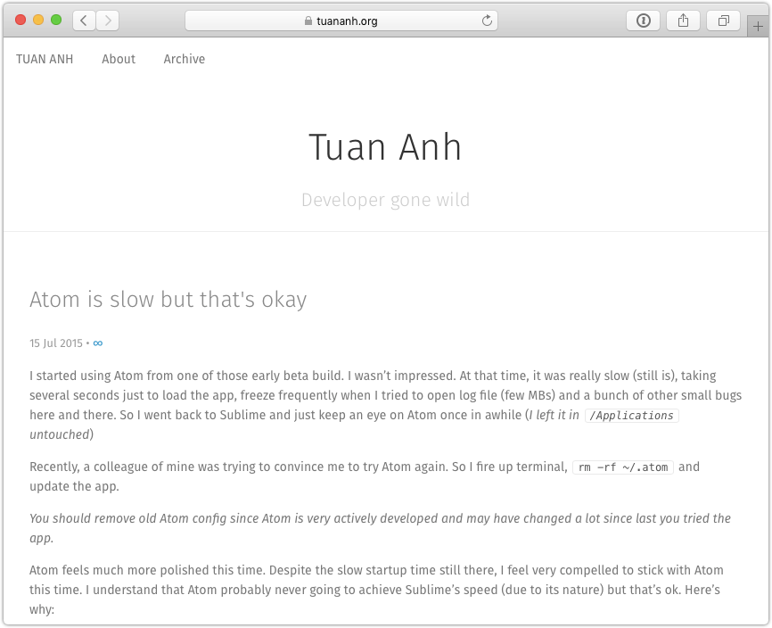

## jekyll-pure

Just a simple, no bullshit jekyll theme, built on top of purecss. Just `git clone`, edit `_config.yml` and you're ready to roll.

If you want to use syntax-highligher, install `rouge` gem as well and enable it in `_config.yml`

## Todos:

- i personally dont see the need for syntax highligher but it's already there. You can enable it by uncommenting the css include in `head.html`
- tag page maybe.
